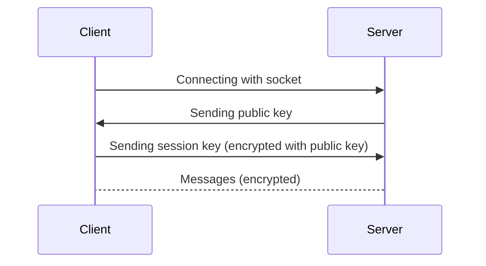

# Chatee: Simple E2E Chat

Cross-platform simple client-server encrypted chat. It is a simple learning project. I'm **not** security researcher, so if you want really secure E2E chat use any professionally written software (not Chatee).

# Security

## Storing private keys
 After generation private keys are encrypted with AES (EAX, 256 bit key) with tag & nonce. KDF: Argon2id (with salt of course)

## Libraries and type of Elliptic Curves

This app uses Ed25519 (*PyNaCl* library). For AES encryption it uses *PyCryptoDome*. For obtaining session key (256 bit) it uses built-in *secrets* library. For getting passwords (without showing in terminal) it uses built-in *getpass* library. For getting Argon2id hash it uses *argon2-cffi* library. For storing public keys it uses sqlite3 (built-in *sqlite3* library).

## Hash Storage
It uses sqlite3 to store records. The key table has the IP, port, and SHA256 of the server's public key. If the server's public key is received that differs from the stored one, the client terminates the connection. If there is no entry with ip:port, it will create an entry.

## Connection flow


1. Connection using socket (IP:port)
2. Server sends his public key (PK)
3. Client gets that public key. If pubic key wasn't saved in key storage it will be saved (IP, port and PK_hash). If public key was changed (saved pk_hash mismatch with current pk_hash) client immediately refuses connection. If everything is OK (saved pk_hash same as current pk_hash) client continues connection.
4. Client generates 256-bit session key, encrypting it with server's PK and sends it. 
5. Now encrypted connection is ready

## Security problems

That connection scheme will protect from passive (eavesdrop) MITM attacks and MITM after first connection (when PK is saved in key storage). But if someone will intercept first connection (when server PK isn't saved in key storage) attacker could get session-key and decrypt messages. 

# Installation
## Fedora

    # dnf update
    # dnf install python3-pynacl
    $ pip install pycryptodome
    $ git clone https://github.com/kolbanidze/chatee
    $ cd chatee
  ## Termux
  

    $ pkg update
    $ pkg install clang python libffi openssl libsodium
    $ SODIUM_INSTALL=system pip install pynacl
    $ git clone https://github.com/kolbanidze/chatee
    $ cd chatee
Thanks to that [guy](https://github.com/pyca/pynacl/issues/483#issuecomment-608049721)
## Other

    git clone https://github.com/kolbanidze/chatee
    cd chatee
    pip install -r requirements.txt
# App usage

## Menu
#### *main.py*
You can: run server, connect to server as client, run account editor and run hash storage editor.

## Client/Server
#### *client.py/server.py*
Just enter ip and port

## Account Editor
#### *account_editor.py*
You can: show all accounts, change password, change username, delete account and delete all accounts

## Hash Storage
#### hash_storage.py
You can: show saved entries, delete entry and delete all entries

## Settings
#### settings.py
You can edit: Hash DB Name, Max Message Length, Salt Size, Hash DB Table Name, Account Storage DB Name, Account Storage DB Table, Argon2id Time Cost, Argon2id Memory Cost, Argon2id Parallelism  

## Commands
/help - show help

/leave - you and your interlocutor will leave chat.

/connectioninfo - shows connection info (ip, port, public_key, session_key)

## Usage
```
python3 main.py
```
or
```
python main.py
```